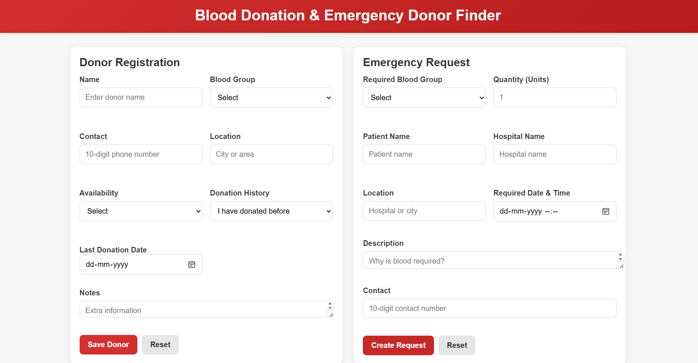
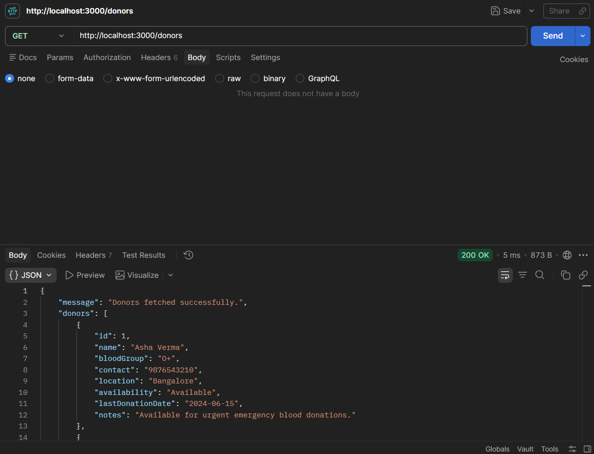
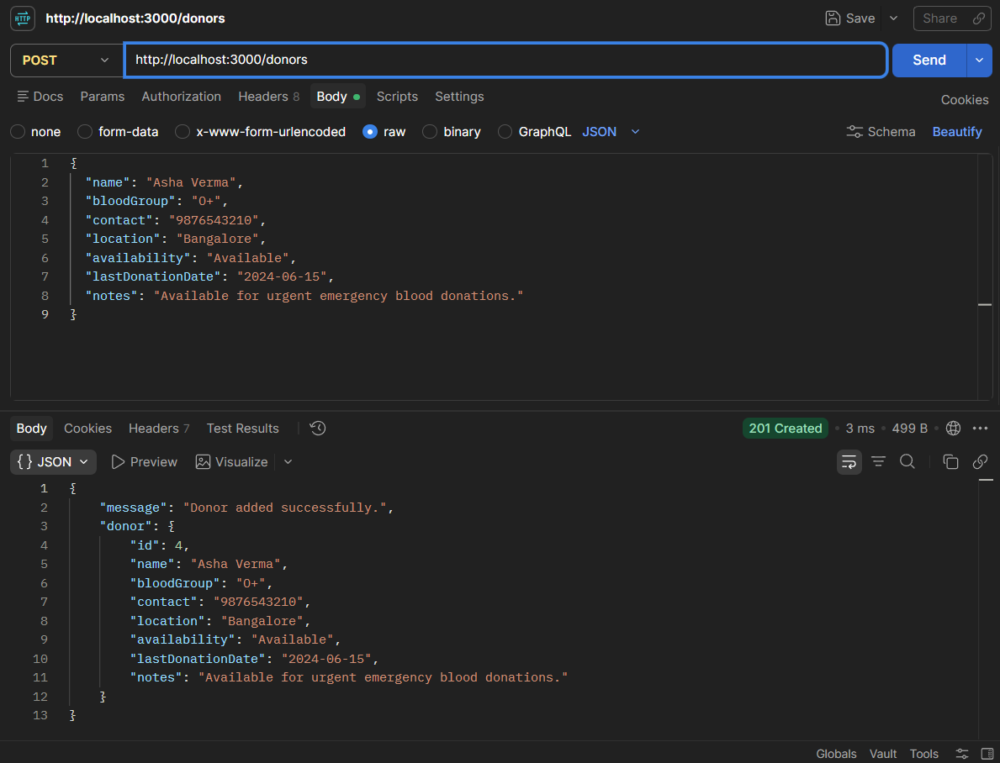
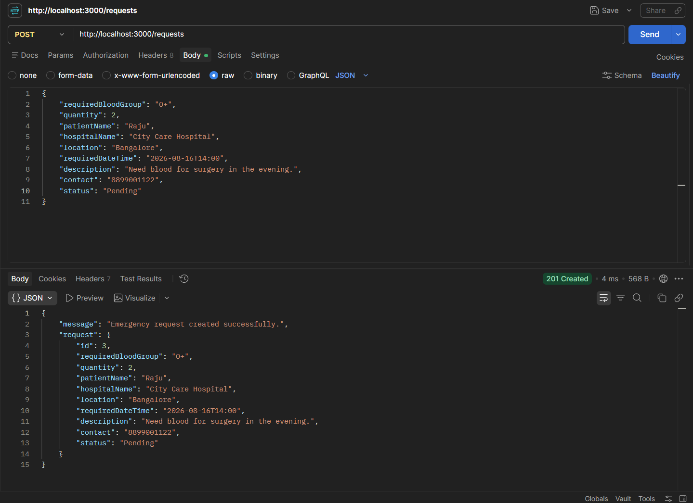

# Blood Donation & Emergency Donor Finder

A blood donation and emergency donor finder project built with HTML, CSS, JavaScript, and Node.js. This project helps users register donors, create emergency blood requests, and manage donor availability using REST API endpoints.

## Project Overview

This project is designed to demonstrate a complete backend API workflow for a healthcare support application. The frontend provides a static user interface while the backend exposes REST API routes for donor and request management.

## Tech Stack

- Frontend: HTML, CSS, JavaScript
- Backend: Node.js + Express
- API Testing: Postman
- Data Storage: In-memory arrays
- Database: Not used in this version

## Features

- Register donor details with blood group, contact, location, and availability
- Add emergency blood requests with patient and hospital data
- View all donors and all requests
- Fetch a single donor or request by ID
- Update donor and request details
- Delete donors and requests
- Validate phone numbers, blood groups, and status values
- Add default values for first-time donors and new requests

## Folder Structure

```bash
capst/
├── backend/
│   └── server.js
├── frontend/
│   ├── index.html
│   ├── style.css
│   └── app.js
├── package.json
├── README.md
└── node_modules/
```

## Demo

Use one homepage screenshot showing both the donor form and emergency request form together.

```md

```

## API Operations

The backend supports CRUD operations for donor and request management.

| Method | Endpoint | Description |
|--------|----------|-------------|
| GET | `/donors` | View all donors |
| POST | `/donors` | Add a donor |
| GET | `/donors/:id` | View one donor |
| PUT | `/donors/:id` | Update donor information |
| DELETE | `/donors/:id` | Delete a donor |
| GET | `/requests` | View all emergency requests |
| POST | `/requests` | Create an emergency request |
| GET | `/requests/:id` | View one request |
| PUT | `/requests/:id` | Update a request |
| DELETE | `/requests/:id` | Delete a request |

## API Testing Demo

### GET all donors

```md

```

### POST create donor

```md

```

### POST create request

```md

```

## Sample Data for Demo

### Add Donor

```json
{
  "name": "Asha Verma",
  "bloodGroup": "O+",
  "contact": "9876543210",
  "location": "Bangalore",
  "availability": "Available",
  "lastDonationDate": "2024-06-15",
  "notes": "Available for urgent emergency blood donations."
}
```

### Add Emergency Request

```json
{
  "requiredBloodGroup": "O+",
  "quantity": 2,
  "patientName": "Raju",
  "hospitalName": "City Care Hospital",
  "location": "Bangalore",
  "requiredDateTime": "2026-08-16T14:00",
  "description": "Need blood for surgery in the evening.",
  "contact": "8899001122",
  "status": "Pending"
}
```

## Validation Rules

### Donor validation

- Name is required
- Blood group must be one of: `A+`, `A-`, `B+`, `B-`, `O+`, `O-`, `AB+`, `AB-`
- Contact must be exactly 10 digits
- Location is required
- Availability must be one of: `Available`, `Busy`, `Unavailable`
- If no donation date is entered, it stores as `Never donated`
- If no notes are entered, it stores as `First-time donor.`

### Emergency request validation

- Required blood group is required and must be valid
- Quantity must be a positive whole number
- Patient name, hospital name, location, date-time, description, and contact are required
- Contact must be exactly 10 digits
- Status defaults to `Pending` if not supplied
- Status must be one of: `Pending`, `Matched`, `Completed`, `Cancelled`

## How to Run

1. Go to the project folder:

```bash
cd capst
```

2. Install dependencies:

```bash
npm install
```

3. Start the backend server:

```bash
npm start
```

The backend runs on:

```text
http://localhost:3000
```

4. Open the frontend in the browser:

- Open `frontend/index.html` directly in a browser

## API Example Response

### GET `/donors`

```json
{
  "message": "Donors fetched successfully.",
  "donors": [
    {
      "id": 1,
      "name": "Asha Verma",
      "bloodGroup": "O+",
      "contact": "9876543210",
      "location": "Bangalore",
      "availability": "Available",
      "lastDonationDate": "2024-06-15",
      "notes": "Available for urgent emergency blood donations."
    }
  ]
}
```

### POST `/requests`

```json
{
  "message": "Emergency request created successfully.",
  "request": {
    "id": 3,
    "requiredBloodGroup": "O+",
    "quantity": 2,
    "patientName": "Raju",
    "hospitalName": "City Care Hospital",
    "location": "Bangalore",
    "requiredDateTime": "2026-08-16T14:00",
    "description": "Need blood for surgery in the evening.",
    "contact": "8899001122",
    "status": "Pending"
  }
}
```

## Important Notes

- This project is intended for college-level learning and evaluation.
- The frontend and backend are intentionally separated.
- Data is stored in memory only and resets when the server restarts.
- No authentication or database is included in this version.

## GitHub Setup

```bash
git init
git add .
git commit -m "Project commit v1"
git branch -M main
git remote add origin https://github.com/YOUR_USERNAME/YOUR_REPO_NAME.git
git push -u origin main
```

Replace the GitHub URL with your repo before pushing.

## Conclusion

This project demonstrates CRUD operations for blood donation management in a simple and beginner-friendly way. It is useful for academic demonstration, API testing, and practicing backend development with Express.js.
